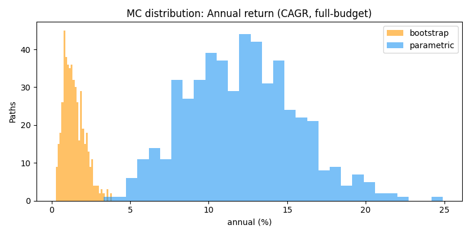
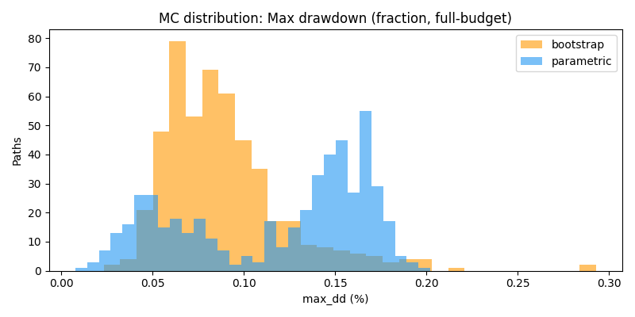
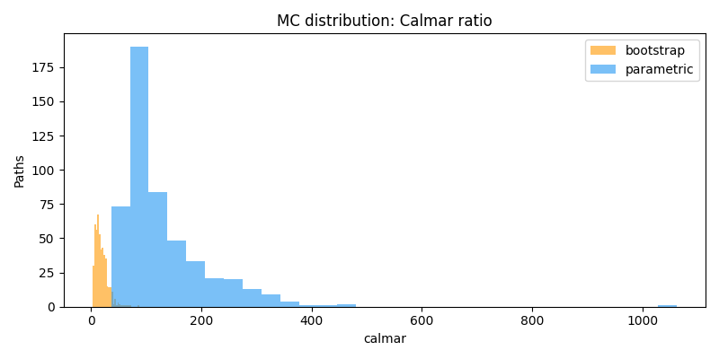

# Monte-Carlo Validation Report: two_phase_margin

_Generated: 2026-06-08 17:45 UTC_

## Run parameters

| Parameter | Value |
|-----------|-------|
| Generators | `bootstrap`, `parametric` |
| Paths per generator | 500 |
| Horizon | 365 d (8760 h) |
| Coins | `BTC,ETH,SOL,HYPE,PURR` |
| Margin buffer (mbuf) | 3.0× |
| Denominator | **Full-portfolio equity (~$1 000 budget)** — NOT occupied capital (see Rule-5 GAP below) |

## Single-path anchor (U-prod, buf=3×)

Source: `research/TWOPHASE_MARGIN_aggregate.csv`, row `universe=U-prod`, `margin_buffer_x=3.0`.  This is the SINGLE historical backtest that motivated the MC study — the MC distributions below show whether this result is a typical outcome or a right-tail artifact.

| Metric | Single-path (full-budget basis) |
|--------|--------------------------------|
| annual_pct (linear, %) | **2.5026%** |
| max_dd_pct (%) | **0.0782%** |
| Sharpe | 20.7388 |
| n_phase1_negstop_exits | 8 |
| n_phase2_exits | 7 |
| Period | 2025-11-06 → 2026-05-12 (4493 h) |

> **Calmar (single-path):** 32.0× (annual_pct / max_dd_pct — linear ratio, not CAGR/fraction)

## Distribution of MC paths (full-budget denominator)

> All metrics computed on full-portfolio equity (budget_cap_usdc ≈ $1 000, including idle cash). `annual` is CAGR-style; `max_dd` is a fraction (e.g. 0.0050 = 0.50%). `calmar` can be ∞ when max_dd = 0.

Both generators available — **side-by-side comparison** follows.  Divergence between parametric and bootstrap indicates model sensitivity (parametric can produce hot-regime paths; bootstrap is cold-history reshuffle).

### Parametric

**Generator:** `parametric` — parametric (log-level AR(1) funding, GBM+jumps price, hot/cold regime switching, cross-coin corr — includes hot & cold regimes)  
**Paths:** 500  |  **Horizon:** 365 d (8760 h)  |  **Coins:** `BTC,ETH,SOL,HYPE,PURR`  |  **mbuf:** 3.0×

> **Denominator note (Rule-5 GAP):** `annual` and `max_dd` below are computed on **full-portfolio equity** (~$1 000 budget incl. idle cash), NOT on deployed/occupied capital. APR on occupied capital is materially higher — see the _Occupied-capital reframe_ section.

| Metric | p05 | p25 | median | p75 | p95 | min | max |
|--------|-----|-----|--------|-----|-----|-----|-----|
| annual (CAGR, full-budget) | 6.5770% | 9.6371% | 12.0748% | 14.4548% | 18.1463% | 3.3063% | 24.9068% |
| max_dd (fraction, full-budget) | 0.0337% | 0.0666% | 0.1381% | 0.1594% | 0.1765% | 0.0075% | 0.2021% |
| Calmar | 57.6578 | 79.9852 | 100.5924 | 162.7584 | 283.2064 | 35.9752 | 1061.5994 |
| Sharpe | 32.7209 | 39.6848 | 44.7086 | 49.5229 | 57.9274 | 24.5030 | 69.8174 |

**Risk probabilities:**

- P(annual < 0) = **0.0%** (0/500 paths)
- P(max_dd > 1%) = **0.0%** (0/500 paths)
- P(max_dd > 5%) = **0.0%** (0/500 paths)
- CVaR annual (worst-5% mean) = **5.6127%** (full-budget basis)

**Exit-mix (averages per path):**

| Exit type | Avg / path |
|-----------|------------|
| Phase-1 neg exits | 0.00 |
| Phase-1 cap exits | 0.07 |
| Phase-1 **NEGSTOP** exits | **0.00** |
| Phase-2 exits | 0.00 |
| Liquidations | 0.61 |
| Forced closes | 1.43 |

### Bootstrap

**Generator:** `bootstrap` — bootstrap (synchronous circular block-resample of real history — cold-only window by construction; see T4 caveat)  
**Paths:** 500  |  **Horizon:** 365 d (8760 h)  |  **Coins:** `BTC,ETH,SOL,HYPE,PURR`  |  **mbuf:** 3.0×

> **Denominator note (Rule-5 GAP):** `annual` and `max_dd` below are computed on **full-portfolio equity** (~$1 000 budget incl. idle cash), NOT on deployed/occupied capital. APR on occupied capital is materially higher — see the _Occupied-capital reframe_ section.

| Metric | p05 | p25 | median | p75 | p95 | min | max |
|--------|-----|-----|--------|-----|-----|-----|-----|
| annual (CAGR, full-budget) | 0.5188% | 0.9271% | 1.3100% | 1.8584% | 2.6390% | 0.2689% | 3.8501% |
| max_dd (fraction, full-budget) | 0.0500% | 0.0646% | 0.0832% | 0.1012% | 0.1580% | 0.0232% | 0.2928% |
| Calmar | 5.1844 | 10.0672 | 15.9521 | 23.9967 | 38.5957 | 2.6713 | 86.9082 |
| Sharpe | 4.7905 | 7.8716 | 10.8764 | 13.7841 | 18.2691 | 2.5367 | 31.7143 |

**Risk probabilities:**

- P(annual < 0) = **0.0%** (0/500 paths)
- P(max_dd > 1%) = **0.0%** (0/500 paths)
- P(max_dd > 5%) = **0.0%** (0/500 paths)
- CVaR annual (worst-5% mean) = **0.4130%** (full-budget basis)

**Exit-mix (averages per path):**

| Exit type | Avg / path |
|-----------|------------|
| Phase-1 neg exits | 0.00 |
| Phase-1 cap exits | 0.02 |
| Phase-1 **NEGSTOP** exits | **2.28** |
| Phase-2 exits | 4.22 |
| Liquidations | 0.02 |
| Forced closes | 0.00 |

### Quick comparison: median metrics

| Metric | parametric | bootstrap | note |
|--------|-----------|-----------|------|
| annual median | 12.0748% | 1.3100% | full-budget |
| max_dd median | 0.1381% | 0.0832% | full-budget |
| Calmar median | 100.5924 | 15.9521 | |
| Sharpe median | 44.7086 | 10.8764 | |
| P(annual < 0) | 0.0% | 0.0% | |
| CVaR annual worst-5% | 5.6127% | 0.4130% | full-budget |

### Single-path vs MC median contrast

| Metric | Single-path | Para median | Boot median |
|--------|-------------|-------------|-------------|
| annual (CAGR approx) | 2.5026% | 12.0748% | 1.3100% |
| max_dd | 0.0782% | 0.1381% | 0.0832% |

> Interpretation: if single-path annual >> MC median, the historical backtest was a favorable-path draw. If single-path Calmar >> MC Calmar distribution, it may be a right-tail artifact. Full verdict deferred to T7 (Opus).

## Occupied-capital reframe (для T7)

All metrics in this report use the **full-portfolio equity denominator** (budget_cap_usdc ≈ $1 000, including idle/undeployed USDC).  This understates APR on a per-deployed-capital basis.

The relationship is:  
```
APR_occupied = APR_full_budget × (budget / avg_deployed)
```
With 7 coins, position_size=\$100, concurrency_cap=K and typical occupancy, avg_deployed ≈ \$300–\$400 out of \$1 000 budget, so the occupied-capital APR is roughly **2.5–3.3× larger** than the full-budget figures shown in the tables.

**Exact multiplier:** requires average deployed notional tracked per hour across all MC paths.  This is NOT stored in the current result columns (T5 output).  The `total_funding` / `total_fees` / `final_equity` columns can be used to reconstruct funding-based APR but not the occupancy fraction directly.  **→ Deferred to T7 (Opus) for accurate reconstruction.**  Do NOT apply an invented multiplier to the tables above.

## Plots





---

_This report was generated by `research/two_phase_margin/monte_carlo/report.py` (T6). Verdict and interpretation deferred to T7 (Opus)._
